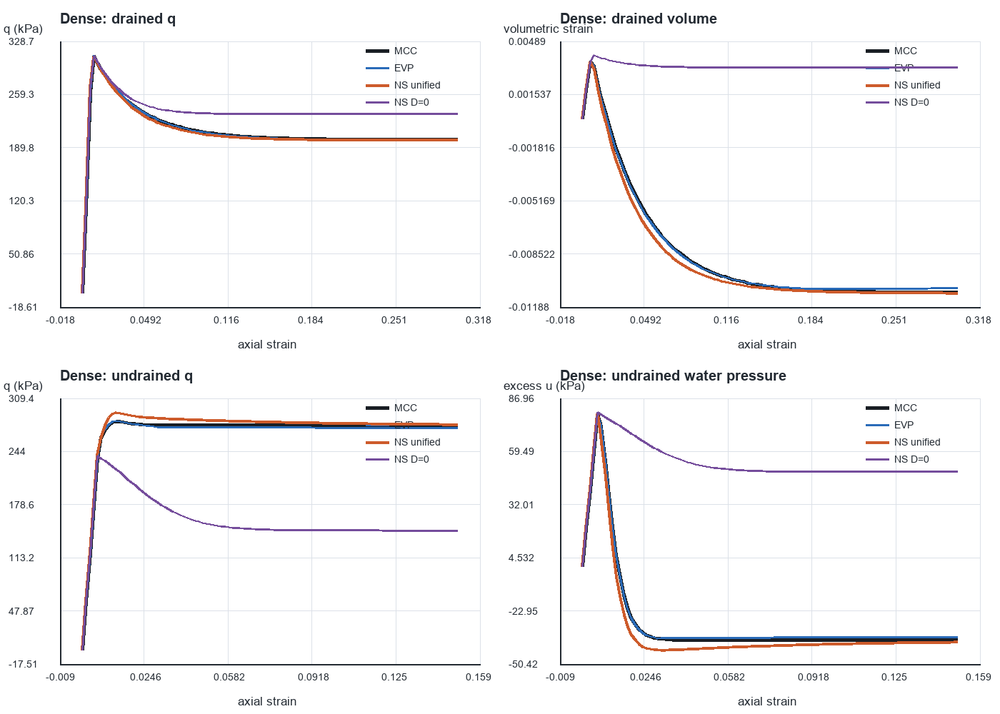
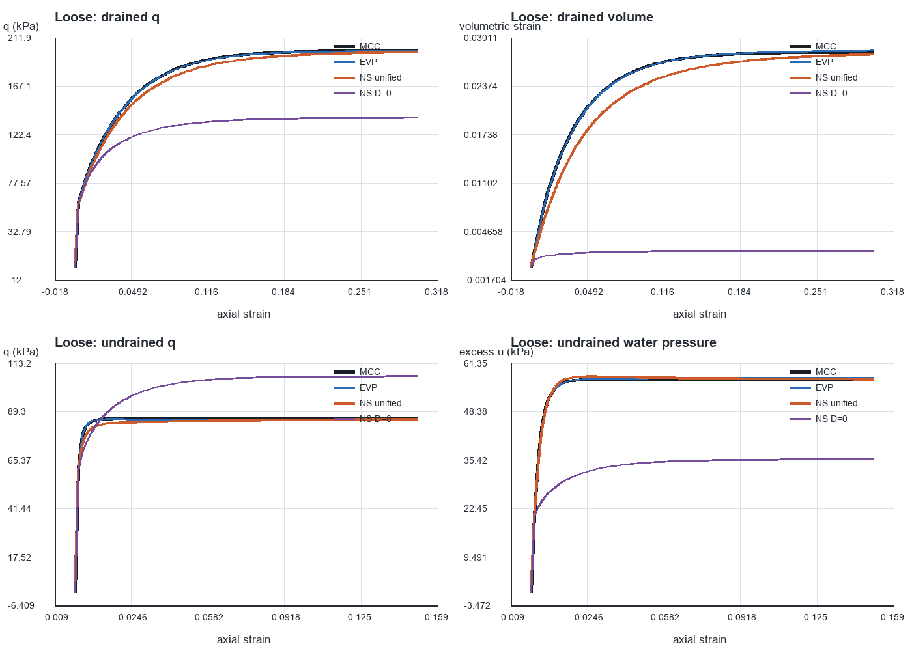

# When MCC, Kelln EVP, and NorSand can—and cannot—be made equivalent

## Executive conclusion

The three models can be made nearly indistinguishable for selected monotonic
triaxial paths, but their native equations cannot be made globally identical
by setting one NorSand parameter to zero.

In particular, forcing NorSand plastic dilatancy to zero is not the required
mapping. Zero dilatancy is the common condition **at critical state**, where
all three models naturally have no further plastic volume change. Away from
critical state, dense dilation and loose contraction are essential parts of
the MCC and EVP response. Removing them destroys both drained volume change
and undrained pore-pressure generation.

The numerical diagnostic in this report confirms this:

| State | Path | Unified NorSand q RMSE | Unified secondary RMSE | NorSand D=0 q RMSE | NorSand D=0 secondary RMSE |
|---|---|---:|---:|---:|---:|
| Dense | Drained | 0.62% | 3.57% in volumetric strain | 8.84% | 113.97% |
| Dense | Undrained | 2.01% | 5.48% in pore pressure | 41.13% | 108.06% |
| Loose | Drained | 2.00% | 6.14% in volumetric strain | 26.93% | 83.12% |
| Loose | Undrained | 1.60% | 1.02% in pore pressure | 20.86% | 38.79% |

The correct approach is to align:

1. the critical-state line and critical stress ratio;
2. the initial void ratio/state parameter;
3. elastic stiffness;
4. the first-yield point;
5. plastic flow direction (dilatancy) over the range of stress ratios;
6. hardening rate over the required density range; and
7. EVP strain rate and viscosity.

Even after those steps, exact equality for every stress path is impossible
without replacing one model's yield surface, flow rule, and hardening law with
those of another model. At that point it is no longer the original model.

## 1. Constitutive structures

The comparison uses compression-positive effective stress, volumetric strain,
and `eta=q/p'`.

### 1.1 Modified Cam-Clay

The MCC yield surface is

```text
f_MCC = q^2/M^2 - p'(pc' - p') = 0.
```

It uses associated flow and isotropic preconsolidation-pressure hardening. In
triaxial compression, the plastic dilatancy under the invariant convention
used by the code is

```text
D_MCC = d epsilon_v^p / d epsilon_q^p
      = (M^2 - eta^2)/(2 eta).
```

Thus:

- `eta < M`: contractive plastic flow;
- `eta = M`: zero dilatancy at critical state;
- `eta > M`: dilative plastic flow.

Elasticity is

```text
K = V p'/kappa,
G = 3(1-2 nu)K/[2(1+nu)].
```

### 1.2 Kelln EVP

The EVP model uses the same critical-state geometry, compression/swelling
slopes, and pressure-dependent elasticity as MCC, but plastic strain is a
time-dependent overstress rate. Its key additional controls are:

- `psi_visc`: viscosity/isotache index;
- `t0`: reference time;
- imposed strain rate;
- `Z`: intercept used in the internal pressure gate.

Because the elastic law, CSL, initial pressure, and initial specific volume are
shared exactly, MCC and EVP are the closest pair. They become nearly equal for
the selected monotonic rate when `psi_visc` is small. They are not universally
equal: changing the strain rate or holding time changes EVP but not MCC.

### 1.3 NorSand

The implemented NorSand outer surface is

```text
f_NS = eta/Mi - 1 + ln(p'/pi') = 0,
D_NS = Mi - eta,
H = H0 - Hy psi,
```

with image-pressure hardening controlled by `H`, `pi_max`, and the current
image state. `Mi` depends on Lode angle and image state:

```text
Mi = M(theta) [1 - N_coupling chi_i |psi_i|/Mtc].
```

The important consequence is that NorSand does **not** contain a single
independent “dilation parameter” that can simply be set to zero. Dilatancy is
the evolving quantity `Mi-eta`. The parameters `chi_tc`, `N_coupling`, `H0`,
and `Hy` influence it indirectly through image friction, limiting state, and
hardening.

Near critical state, if `N_coupling` is small, `Mi` approaches `M` and

```text
D_NS approximately M - eta.
```

Meanwhile, expanding the MCC expression near `eta=M` also gives

```text
D_MCC approximately M - eta.
```

This explains why reducing image-friction coupling—not deleting dilatancy—can
make the models' flow directions similar near critical state.

## 2. Conditions for exact equality

### 2.1 Critical-state equality

At critical state the three models can satisfy exactly the same conditions:

```text
q = M p',
e = Gamma - lambda ln(p'/p_ref),
D = 0.
```

For the drained constant-cell-pressure tests with `M=1.2` and
`sigma_3'=100 kPa`, the common analytical endpoint is

```text
q_cs = 200.000 kPa,
p'_cs = 166.667 kPa.
```

This is where zero dilatancy belongs. It is an endpoint condition, not a
constitutive setting for the entire test.

### 2.2 Full-path equality

For full equality at every increment, all of the following would have to be
equal at every state:

```text
elastic tangent:       D_e,MCC = D_e,EVP = D_e,NS
yield/loading surface: f_MCC = f_EVP = f_NS
plastic direction:     D_MCC(eta) = D_EVP = D_NS(eta,psi_i)
hardening modulus:      dpc'/d epsilon_p = mapped dpi'/d epsilon_p
rate law:               EVP overstress rate = rate-independent multiplier
```

The native MCC ellipse and logarithmic NorSand surface have different
curvature, and their hardening variables are not interchangeable. Therefore,
no fixed native parameter set produces exact equality for arbitrary loading.

## 3. Material properties used in the project

### 3.1 Common properties

| Property | Symbol/code name | Value |
|---|---|---:|
| Initial effective pressure | `p_initial` | 100 kPa |
| Critical stress ratio | `M`, `M_tc` | 1.2 |
| Compression slope | `lambda_c` | 0.06 |
| Swelling slope | `kappa` | 0.01 |
| CSL void-ratio intercept | `Gamma` | 0.80 |
| Reference pressure | `p_ref` | 100 kPa |
| Poisson ratio | `nu` | 0.20 |
| Dense state parameter | `psi` | -0.05 |
| Loose state parameter | `psi` | +0.02 |
| Strain rate | `strain_rate` | 0.001 per time unit |

The exact CSL-intercept mapping used for MCC and EVP is

```text
N = 1 + Gamma + (lambda-kappa) ln(2) = 1.834657359.
```

The initial state mapping is

```text
pc'/p' = 2 exp[-psi/(lambda-kappa)].
```

| State | Initial V | MCC/EVP pc' | pc'/p' |
|---|---:|---:|---:|
| Dense | 1.75 | 543.656 kPa | 5.4366 |
| Loose | 1.82 | 134.064 kPa | 1.3406 |

### 3.2 Model-specific properties in the original comparisons

| Parameter | MCC | EVP | NorSand drained | NorSand undrained |
|---|---:|---:|---:|---:|
| `M` or `M_tc` | 1.2 | 1.2 | 1.2 | 1.2 |
| `lambda_c` | 0.06 | 0.06 | 0.06 | 0.06 |
| `kappa` | 0.01 | 0.01 | — | — |
| `N` | 1.834657 | 1.834657 | — | — |
| `Gamma` | — | — | 0.80 | 0.80 |
| `psi_visc` | — | 0.0001 | — | — |
| `t0` | — | 1.0 | — | — |
| `Z` | — | 1.0 | false | false |
| `chi_tc` | — | — | 4.5 | 4.5 |
| `N_coupling` | — | — | 0.30 | 0.30 |
| `H0` | — | — | **37** | **75** |
| `Hy` | — | — | 260 | 260 |
| `G_ref` | — | — | 13,400 kPa | 13,400 kPa |
| `m` | — | — | 1.0 | 1.0 |
| `nu` | 0.20 | 0.20 | 0.20 | 0.20 |

The bold entries expose an important limitation of the earlier plots: drained
and undrained NorSand used different `H0` values. Those results demonstrate
path-specific calibration, not one universal NorSand parameter set.

The original first-yield mapping was:

| State | MCC yield p' | MCC yield q | NorSand OCR |
|---|---:|---:|---:|
| Dense | 205.438 kPa | 316.315 kPa | 7.4585 |
| Loose | 117.601 kPa | 52.802 kPa | 1.7183 |

### 3.3 HM fluid properties

| Property | Dense | Loose |
|---|---:|---:|
| Initial porosity | 0.428571 | 0.450549 |
| Water bulk modulus | 2.2e6 kPa | 2.2e6 kPa |
| Grain bulk modulus | 36e6 kPa | 36e6 kPa |
| Biot coefficient | 1.0 | 1.0 |
| Storage | 2.10678e-7 1/kPa | 2.20058e-7 1/kPa |
| Mobility in closed test | 0 | 0 |
| Pressure stabilization factor | 0.05 | 0.05 |

### 3.4 Numerical test configuration

| Item | Drained FE | Undrained HM FE | Unified diagnostic |
|---|---|---|---|
| Geometry | axisymmetric cylinder, R=1, H=2 | axisymmetric cylinder, R=1, H=2 | ideal triaxial material point |
| Spatial discretization | one homogeneous Quad4, 2x2 Gauss | one homogeneous u-p Quad4, 2x2 Gauss | no spatial discretization |
| Initial effective pressure | 100 kPa | 100 kPa | 100 kPa |
| Initial excess pore pressure | not applicable | 0 kPa | 0 kPa |
| Lateral condition | constant effective cell stress | constant total cell stress | ideal matching condition |
| Hydraulic boundary | drained by definition | closed/no flow | drained or zero-volume |
| Final axial strain | 30% | 15% | 30% drained, 15% undrained |
| Output increments | 120 | 100 | 100 |

The homogeneous one-element tests are constitutive patch tests: they verify
the material response and coupled assembly without introducing localization,
end friction, or mesh-dependent nonuniformity.

## 4. Original path-specific FE comparisons

### 4.1 Drained 2-D FE, 30% axial strain

| State | Model | Peak q | Final q | Final eps_v | q RMSE vs MCC | eps_v RMSE vs MCC |
|---|---|---:|---:|---:|---:|---:|
| Dense | MCC | 314.43 | 200.08 | -0.01089 | — | — |
| Dense | EVP | 314.87 | 200.06 | -0.01082 | 0.72% | 3.33% |
| Dense | NorSand | 314.39 | 199.39 | -0.01137 | 0.89% | 15.18% |
| Loose | MCC | 199.94 | 199.94 | +0.02831 | — | — |
| Loose | EVP | 198.74 | 198.74 | +0.02818 | 0.88% | 1.06% |
| Loose | NorSand | 195.52 | 195.52 | +0.02738 | 2.85% | 8.03% |

The stresses are much easier to match than the transient volume curves. The
volume differences expose the different flow rules even when all models reach
nearly the same CSL.

### 4.2 Undrained 2-D HM FE, 15% axial strain

| State | Model | Peak q | Final q | Maximum u | Final u | q RMSE vs MCC | u RMSE vs MCC |
|---|---|---:|---:|---:|---:|---:|---:|
| Dense | MCC | 280.52 | 275.78 | +78.50 | -37.89 | — | — |
| Dense | EVP | 281.47 | 273.64 | +78.50 | -36.87 | 0.68% | 1.14% |
| Dense | NorSand | 285.73 | 276.14 | +78.20 | -37.70 | 0.54% | 4.20% |
| Loose | MCC | 86.00 | 86.00 | +57.00 | +57.00 | — | — |
| Loose | EVP | 85.74 | 85.18 | +57.44 | +57.40 | 0.75% | 0.55% |
| Loose | NorSand | 87.92 | 86.39 | +56.55 | +56.55 | 1.32% | 1.51% |

Under undrained loading, volumetric strain is constrained by fluid mass
balance. Differences in plastic dilatancy therefore appear primarily as
differences in effective mean stress and excess pore pressure.

## 5. A single unified NorSand compromise

A joint material-point search over dense/loose and drained/undrained paths
found the following useful single compromise:

| Parameter | Unified value |
|---|---:|
| `M_tc` | 1.2 |
| `Gamma` | 0.80 |
| `lambda_c` | 0.06 |
| `G_ref` | 13,400 kPa |
| `m` | 1.0 |
| `nu` | 0.20 |
| `chi_tc` | 6.0 |
| `N_coupling` | 0.10 |
| `H0` | 44.0 |
| `Hy` | 720.0 |
| `Z` | false |

The matched OCR values change slightly because `chi_tc` and `N_coupling`
alter the image surface:

| State | Unified OCR | Initial H=H0-Hy psi |
|---|---:|---:|
| Dense | 7.4333 | 80.0 |
| Loose | 1.7139 | 29.6 |

The high `Hy` is doing important work: it allows one parameter set to give the
dense and loose states very different hardening rates. With this one set:

| State | Path | q RMSE vs MCC | Secondary RMSE vs MCC |
|---|---|---:|---:|
| Dense | Drained | 0.62% | eps_v: 3.57% |
| Dense | Undrained | 2.01% | u: 5.48% |
| Loose | Drained | 2.00% | eps_v: 6.14% |
| Loose | Undrained | 1.60% | u: 1.02% |

This is a defensible demonstration that one NorSand set can approximate MCC
across all four selected monotonic paths. It is less exact than separate
path-specific fits, as it must be.

## 6. Why zero NorSand dilatancy fails

The diagnostic `NS D=0` curves force `D_NS=0` during every plastic increment.
This produces two immediate consequences.

### Drained loading

Plastic shear produces no plastic volume change. The response retains only a
small elastic volumetric component, so it cannot reproduce MCC contraction or
dilation. For the dense test, the final volumetric strain even has the wrong
sign: `+0.00325` instead of MCC `-0.01097`.

### Undrained loading

Total volume is already constrained. Normally, the elastic volumetric strain
needed to offset plastic dilation/contraction changes `p'`, and total-stress
equilibrium converts that change into pore pressure. With `D=0`, this coupling
is removed after yield. In the diagnostic dense test, NorSand remains near
`p'=100 kPa`, ends at `q=146.8 kPa`, and predicts `u=+48.9 kPa`; MCC ends at
`p'=230.1 kPa`, `q=276.1 kPa`, and `u=-38.1 kPa`.

Therefore, zero dilatancy is appropriate only:

- at the critical-state point itself;
- for a deliberately idealized isochoric plastic model; or
- over a very narrow range where the target model also has `D approximately 0`.

It is not the MCC–NorSand equivalence transformation.

## 7. Parameters responsible for the remaining differences

### `M` / `M_tc`

Controls the critical stress ratio and dominates the final stress endpoint.
It must be shared first. Changing it to improve an early peak will usually
destroy the common critical state.

### `Gamma`, `lambda_c`, `N`, and `kappa`

Define the CSL and normal-compression/swelling geometry. `N` is mapped exactly
from `Gamma`; it should not be fitted independently after that mapping.
`kappa` also controls MCC/EVP elastic bulk stiffness, whereas NorSand has no
native `kappa` elasticity.

### `G_ref`, `m`, `nu`

Control initial and pressure-dependent stiffness. MCC gives initial
`G=13,125 kPa` for the dense state and `13,650 kPa` for the loose state;
NorSand uses `G_ref=13,400 kPa`. The initial mismatch is about +/-2%. Exact
elastic equality at every pressure and void ratio is impossible because MCC
uses `G proportional Vp'/kappa`, while NorSand uses `G proportional p'^m`.

### Initial `pc'`, image pressure, and OCR

Control the onset of plasticity. Matching the first yield point removes a
large source of curve differences, but it cannot make the differently curved
yield surfaces coincide afterward.

### `N_coupling` and `chi_tc`

Control image friction, limiting state, and the evolution of dilatancy. A
smaller `N_coupling` keeps `Mi` closer to `M`, which makes `D_NS=M-eta` resemble
the near-critical MCC flow direction. `chi_tc` changes the strength of state
effects and the limiting image pressure. Neither parameter should simply be
set to zero without rechecking surface admissibility and the full path.

### `H0` and `Hy`

Control image-pressure hardening through `H=H0-Hy psi`. They strongly affect
peak strength, post-peak approach, and density dependence. The need for
different path-specific `H0` values was the clearest sign that the initial fit
was not universal. The unified fit uses a much larger `Hy` so one set can
produce dense `H=80` and loose `H=29.6` initially.

### NorSand `Z` and softening formulation

The matching studies use `Z=false`. Turning contractive softening on changes
loose undrained response and would require recalibration. It is not needed to
make the present mild loose state (`psi=+0.02`) match MCC.

### EVP `psi_visc`, `t0`, and strain rate

These determine rate effects. The present `psi_visc=1e-4`, `t0=1`, and strain
rate `0.001` make EVP close to MCC for these monotonic tests. A rate sweep is
required before claiming equality at another laboratory or field rate.

### Drainage condition

Drainage does not change the constitutive parameters, but it changes which
model differences become visible:

- drained: flow-rule differences appear as volumetric strain;
- undrained: the same differences appear as `p'` and pore pressure;
- partially drained: differences appear in both and interact with
  permeability and loading rate.

## 8. Recommended calibration workflow

1. Fix `M`, `Gamma`, `lambda`, and `p_ref` from critical-state data.
2. Map MCC/EVP `N` from `Gamma`; do not fit it independently.
3. Match elasticity using `nu`, `G_ref`, and `m` over the pressure interval of
   interest, not only at `p'=100 kPa`.
4. Choose common initial `psi`; map it to MCC/EVP `pc'`.
5. Solve NorSand OCR/image pressure so first yield matches MCC.
6. Match drained volumetric response by adjusting `chi_tc`, `N_coupling`,
   `H0`, and `Hy` while keeping the CSL fixed.
7. Validate the same set against undrained `q`, `p'`, and `u` without changing
   parameters.
8. Calibrate EVP viscosity using at least two strain rates.
9. Validate on paths not used for calibration before using the models
   predictively.

If exact agreement is required for code verification, use one constitutive
law in all three wrappers. If physical model comparison is required, retain
the native laws and accept a quantified calibration error.

## 9. Verification and files

The standard FE implementations remain independently verified:

- drained FE/material-point q RMSE: at most 0.81%;
- undrained HM FE/material-point q RMSE: at most 0.50%;
- undrained HM FE/material-point pore-pressure RMSE: at most 0.90%;
- 13 automated tests pass;
- analytical u-p patch errors are approximately machine precision.

Detailed data:

- `results/fe2d_drained_summary.csv`
- `hm_2d/results/undrained_summary.csv`
- `results/unified_matching_summary.csv`
- `results/unified_dense_drained_histories.csv`
- `results/unified_dense_undrained_histories.csv`
- `results/unified_loose_drained_histories.csv`
- `results/unified_loose_undrained_histories.csv`

Unified and zero-dilatancy figures:





## Final answer

The three models become the same only at the shared critical-state condition,
or approximately along selected paths after a multi-parameter calibration.
For NorSand, the useful direction is to keep evolving dilatancy, reduce the
state dependence of `Mi` when necessary, match first yield, and calibrate
`H0/Hy` jointly. Setting dilatancy to zero makes the match substantially worse.
